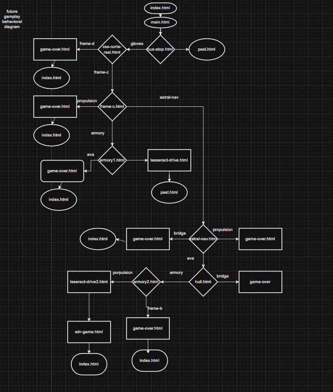

# INTRODUCTION

Time Shift is an interactive choose your own adventure website developed by Joshua Johnson,
and Zachary Roberts. In Time Shift the user navigates webpages and is presented with choices similar to a text-adventure. The user selects their choices which may affect their outcome. The game is set in the present but the user is soon teleported through time as they progress through the game.

# DESIGN DIAGRAMS

## Usecase Diagram

This use case diagram demonstrates the client side flat-file architecture Time Shift uses to create an elegant but immersive user experience.

## Future Behavior Diagram
This behavior diagram tracks system behavior based on user selections in the future timeline. There are multiple game over terminators which redirect to index.html, 2 time travel states between time lines and one win game terminator.

## Past Behavior Diagram

FIXME past timeline behavior diagram goes here

# DATA DESIGN
Time Shift is designed to be light-weight, therefore Time Shift uses client-side flat-file structures  stored with in HTML and in some cases JavaScript codebases. The text output drives the story, adds lore, and embeds easter eggs. This design was chosen for scalability and simplicity to help meet the demands of a short runway. This architecture is congruent from the fast, fun diversion that Time Shift is intended to provide to users.

# INTERFACE DESIGN
Time Shift is a text-based adventure and the UI reflects that game mechanic. Each HTML document provides story narrative, next the user is presented several decisions via buttons that determine in what manner the user wants to advance the narrative or solve a problem posed by the story. These buttons are placed in selection_suite classes. Some buttons serve a method to advance the story by allowing the user to interact with it, such as interacting with a terminal in-game.

An example of a UI driven narrative is below:

# TEST CASES
1. Ensure each page for at least 2 user choices per page if page does not terminate.
    - Test: each non-terminating page for at least 2 user selection options.
    - Action: click all available selections.
    - Expected: each selection should function as designed

2. Ensure endgame behavior functions as designed.
    - Test: Each endgame condition
    - Action: navigate each endgame sequence.
    - Expected: All endgame conditions function as designed.

3. Ensure back and refresh redirect to index.html after development is completed.
    - Test: attempt back and refresh on each page.
    - Action: attempt back and refresh on each page.
    - Expected: each page redirects to index.html on refresh or back.

4. Ensure Time Shift is optimized for all screen sizes.
    - Test: Time Shift renders correctly on all screen sizes
    - Action: test each page in dev tools, and mobile devices.
    - Expected: all pages render as expected.

# SUMMARY

Time Shift is intended to be a short diversion for users that work on computers daily. The given design paradigms ensure the development team can deliver a quality product to meet the declared specifications of Time Shift. The Behavior Diagrams will assist the development team with webpage development given the fairly complex selection pathways. The Use Case diagram depicts Time Shift's simplicity-by-design.