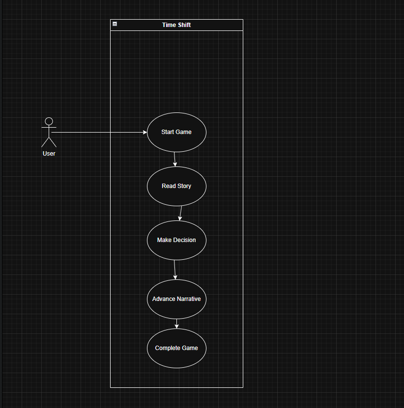
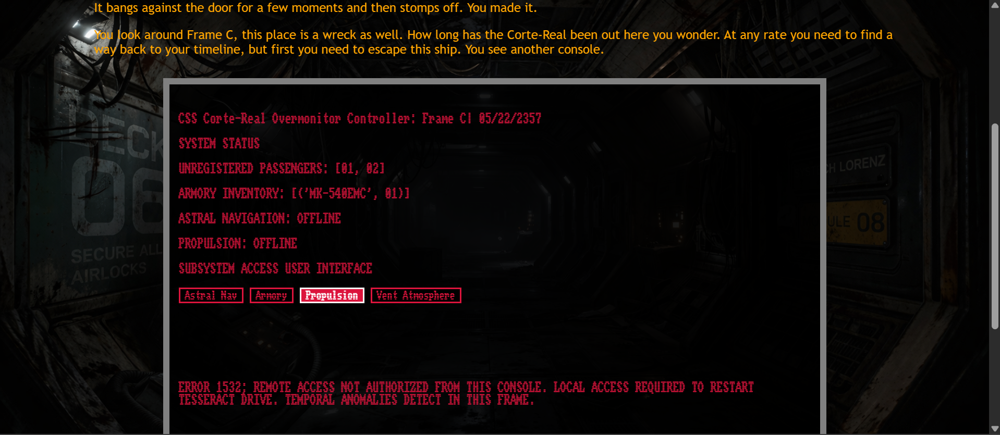

# INTRODUCTION

Time Shift is an interactive choose your own adventure website developed by Joshua Johnson,
and Zachary Roberts. In Time Shift the user navigates webpages and is presented with choices similar to a text-adventure. The user selects their choices which may affect their outcome. The game is set in the present but the user is soon teleported through time as they progress through the game.

# DESIGN DIAGRAMS

## Usecase Diagram

## Future Behavior Diagram
future timeline behavior diagram

## Past Behavior Diagram

past timeline behavior diagram

# DATA DESIGN

# INTERFACE DESIGN
Time Shift is a text-based adventure and the UI reflects that game mechanic. Each HTML document provides story narrative, next the user is presented several decisions via buttons that determine in what manner the user wants to advance the narrative or solve a problem posed by the story. These buttons are placed in selection_suite classes. Some buttons serve a method to advance the story by allowing the user to interact with it, such as interacting with a terminal in-game. 

An example of a UI driven narrative is below: 

# TEST CASES

# SUMMARY