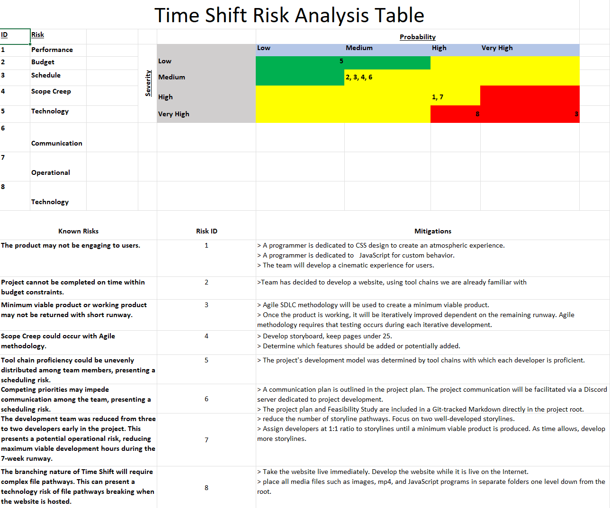

# PROJECT PLAN FOR TIME SHIFT AN INTERACTIVE CHOOSE YOUR OWN ADVENTURE WEBSITE (CYOA)

## 1. INTRODUCTION

Time Shift is an interactive choose your own adventure website developed by Joshua Johnson,
and Zachary Roberts. In Time Shift the user navigates webpages and is presented with choices similar to a text-adventure. The user selects their choices which may affect their outcome. The game is set in the present but the user is soon teleported through time as they progress through the game.

## 2.  PROJECT ORGANIZATION

ORGANIZER Zachary Roberts-
    Zachary Roberts organizes the development team, he ensures tasks are created, assigned, and executed. He
    also contributes to file structure and HTML. 

DESIGNER Joshua Johnson-
    Joshua Johnson contributes to game design, storyboard, and CSS design. He designs the overall mood
    of Time Shift.


## 3. RISK ANALYSIS



## 4. HARDWARE & SOFTWARE REQUIREMENTS

1. HARDWARE
    - Windows, Linux, or Mac Computer
    - Keyboard
    - Mouse

2. SOFTWARE
    - Internet Browser

## 5. WORK BREAK DOWN

1. Planning
    - 1.1 Feasibility Study
    - 1.2 Risk Assessment 
    - 1.3 Project Plan
    - 1.4 Development team meeting schedule
    - 1.5 Create GitHub shared repository
    - 1.6 Create Discord server for team meeting. 
2. Design 
    - 2.1 Story Board
    - 2.2 Wireframe 
    - 2.3 CSS styles
    - 2.4 JavaScript programs 
    - 2.5 UI and UX 
    - 2.6 Design page reload behavior (redirect to index.html on reload or back)
    
3. Development
    - 3.1 Create homepage layout
    - 3.2 Create subsequent page layouts based on storyboard
    - 3.3 Create navigation structure
    - 3.4 Create mobile friendly design
    - 3.5 Create favicon 
    - 3.6 Create Time Shift logo
    - 3.7 Create Future timeline
    - 3.8 Create Past timeline
    - 3.9 Apply CSS styles

4. Testing
    - 4.1 Test links
    - 4.2 Test site stability with different screen sizes
    - 4.3 Validate HTML/CSS
    - 4.4 Fix issues as they are discovered

5. Deployment
    - 5.1 Deploy Time Shift to GitHub Pages
    - 5.2 Verify live site functions as designed

6. Documentation
    - 6.1 Document File Tree
    - 6.2 Complete README.MD 
    - 6.3 Provide notes for general usage

## 6. FILE TREE
```
sdev_265_project/
├──README.md
├──FEASIBILITY_STUDY.md
├──PROJECT_PLAN.md
├──style/
|    └──time_shift.css
images/
    ├──risk_ana.png
|   └──image.png
javascript/
|   └──javaScriptProgram.js
├──index.html
|    ├──spaceship.html
|    |   ├──engineering1.html 
|    |   └──bridge.html
|    |         ├──armory.html
|    |         ├──airlock.html
|    |         └──engineering2.html
|    |          
|    |
|    └──tavern.html
|        ├──castle.html
|        |    ├──gladiator.html
|        |    ├──mage.html
|        |    └──dragon2.html
|        |   
|        └──dragon1.html
```

## 7. PROJECT SCHEDULE

| TASK NUMBER | TASK NAME | TASK ESTIMATED COMPLETION TIME WEEKS | ACTUAL COMPLETION TIME WEEKS | DEPENDENCIES |
| ---- | -- | - | - | ------ |
| 1  |PLA|1|0|   |
| 1.1|FS|1|0|    |
| 1.2|RA|1| |    |
| 1.3|PP|1| |    |
| 1.4|TM|1|0|    |
| 1.5|GH|1|1|    |
| 1.6|DS|1|1|    |
| 2  |DES|2||1-1.6|
| 2.1|SB |1||1-1.6|
| 2.2|WF |1||1-1.6|
| 2.3|CS |2||     |
| 2.4|JS |2||1-1.6|
| 2.5|UI |2||1-1.6|
| 2.6|RL |2||1-2.5|
| 3  |DEV|3||1-2 |
| 3.1|HP |1||1-2 |
| 3.2|LO |1||2.1 |
| 3.3|NA |3||    |
| 3.4|MF |1||    |
| 3.5|FI |1||    |
| 3.6|LG |1||    |
| 3.7|FT |3||    |
| 3.8|PT |3||    |
| 3.9|AC |1||    |
| 4  |TES|1||    |
| 4.1|TL |1||3.3 |
| 4.2|TS |1||    |
| 4.3|VH |1||3.3 |
| 4.4|FX |7||UKN |
| 5  |DEP|1||    |
| 5.1|DG |1|0|   |
| 5.2|VL |1||    |
| 6  |DOC|1||    |
| 6.1|TR |1||1-5.2|
| 6.2|RM |1||1-5.2|
| 6.3|UN |1||1-5.2|
|    |   | ||    |
## 8. MONITORING & REPORTING

The team will use Discord for team meeting, file sharing, and any administrative business. Live team meetings will be held on Fridays from 1800-2100 as needed. Project version control will be maintained on GitHub in a repository named 'sdev_265_project'. For disaster management considerations the
project files will be backed up on SSD, or HDD at regular intervals.

| TASK NUMBER | TASK NAME | ASSIGNED TO | COMPLETE |
| ---- | --- | --- | - |
|  1  |  PLN  | ALL | |
| 1.1 |  FS | ZR | |
| 1.2 |  RA | ZR | |
| 1.3 |  PP | ALL| |
| 1.4 |  TM | ZR  | T|
| 1.5 |  GH |  ZR | T |
| 1.6 |  DS |  JJ | T |
| 2  |   DES | ALL| |
| 2.1 |  SB | ALL|  |
| 2.2 |  WF |  JJ|  |
| 2.3 |  CS | ALL|  |
| 2.4 |  JS |  JJ|  |
| 2.5 |  UI|  ZR  |  |
| 2.6 |  RL | ZR  |  |
| 3   | DEV | ALL|  |
| 3.1 | HP  | JJ |  |
| 3.2 |  LO | ALL|  |
| 3.3 |  NA | ALL|  |
| 3.4 |  MF | JJ |  |
| 3.5 |  FI | ZR |  |
| 3.6 |  LG | ALL|  |
| 3.7 |  FT | ZR |  |
| 3.8 |  PT | JJ |  |
| 3.9 |  AC | JJ |  |
| 4   | TES | ALL|  |
| 4.1 |  TL | ALL|  |
| 4.2 |  TS | JJ|  |
| 4.3 |  VH | ZR |  |
| 4.4 |  FX | ALL|  |
| 5   | DEP | ALL |  |
| 5.1 |  DG |  ZR  | T |
| 5.2 |  VL | ALL|  |
| 6   | DOC | ALL |  |
| 6.1 |  TR |  ZR|  |
| 6.2 | RM | ALL |  |
| 6.3 | UN | ALL |  |
|    |     |    |  |


## 9. APPENDIX